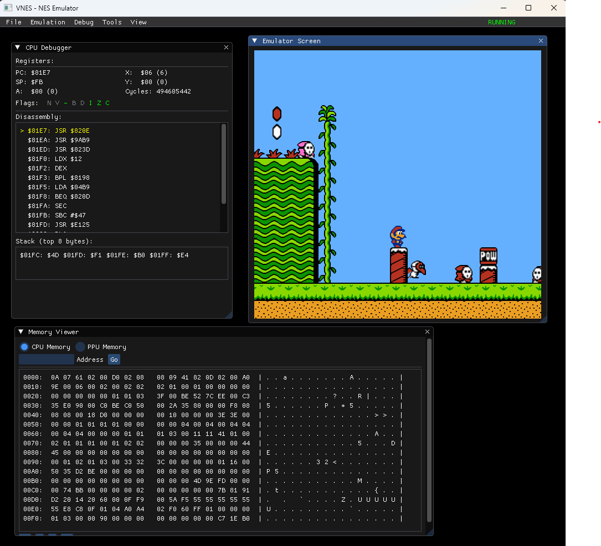

# vNES - A "Minimal" NES Emulator



Because who doesn't want to spend an hour vibe-coding a 1983 gaming console from scratch? 🎮

Yes this was 95% vibe coded, believe me. Of course I know the technical stack of NES system, as I've written other emulators from scratch before..

No, it was not prompted like: "Write me a NES emulator with SOUND, VIDEO, INPUT an a DEBUGGER". It's not like that.

## What Is This?

A Nintendo Entertainment System (NES) emulator written in C++11 that actually, somehow, runs games. Not well. Not perfectly. But it runs them. Whether you intended it to or not.

Built with the philosophy of "just make it work" and "I'll fix the segfaults later" (spoiler: we did fix them, mostly).

## Language & Build

- **Language:** C++11 Following K.I.S.S. process, (except for debugger)
- **Build System:** Makefile (yes, really)
- **Dependencies:** SFML 2.x (for graphics, audio, and input)
- **Compiler Flags:** `-Wall -Wextra -Werror -O0 -g` (fail fast, debug later)

```bash
make        # Builds the emulator
make clean  # Pretend the audio crackling never happened
```

## What Actually Works

### CPU
- Full MOS 6502 processor with all 151 official opcodes
- Includes a 6502 debugger because stepping through code one instruction at a time is fun

### PPU (Graphics)
- **2C02 NTSC rendering pipeline** with 256x240 resolution at 60 Hz
- **Background rendering:** 32x30 tile nametables with 8x8 pixel tiles, fine X/Y scrolling via loopy registers
- **Sprite rendering:** 64 sprites with 8x8 or 8x16 modes, up to 8 per scanline with overflow flag
- **Sprite 0 hit detection:** For raster effects and status bar splits (triggers once per frame on opaque pixel overlap)
- **Pattern tables:** Two 4KB CHR banks for tile and sprite graphics
- **Palette system:** 8 background + 8 sprite palettes, 4 colors each from 64-color master palette
- **Attribute tables:** 2x2 tile color selection with proper quadrant handling
- **Registers:** Full $2000-$2007 register set with proper read/write behavior and buffering
- **Timing quirks:** Odd frame cycle skip, OAMADDR corruption during rendering, decay on unused register bits

### APU (Audio)
- **5 audio channels:** 2 pulse waves (square), 1 triangle, 1 noise, 1 DMC (sample playback)
- **Pulse channels:** Duty cycle control (12.5%, 25%, 50%, 75%), sweep units for pitch bending, envelope generators
- **Triangle channel:** Linear counter for smooth waveforms, no volume control (fixed amplitude)
- **Noise channel:** 16-bit LFSR with two modes (15-bit and 1-bit feedback), envelope control
- **DMC channel:** 7-bit delta-encoded sample playback from memory, IRQ support, direct memory access
- **Frame counter:** 4-step and 5-step modes with configurable IRQ generation
- **Length counters:** Automatic note duration control for all channels except DMC
- **Mixing:** Proper non-linear mixing with lookup tables for accurate NES audio characteristics
- **Output:** 44.1 kHz sample rate with thread-safe ring buffer streaming to SFML audio backend
- **Registers:** Full $4000-$4017 register set with proper write-only and read-only behavior

### Input
- Full NES controller emulation via keyboard
- Arrow keys = D-pad
- Z = A button, X = B button
- Enter = Start, Right Shift = Select

### ROM Support
- **Mapper 0 (NROM):** Simple 16KB or 32KB games (Donkey Kong, Mario Bros.)
- **Mapper 1 (MMC1):** Bank switching, dynamic mirroring, PRG RAM at $6000-$7FFF (Zelda, Metroid, Castlevania II)
- **Mapper 2 (UxROM):** Switchable 16KB PRG banks, fixed CHR (Mega Man, Castlevania)
- **Mapper 4 (MMC3):** Advanced bank switching with scanline IRQ counter (Super Mario Bros. 3, Mega Man 4-6)
- **Mapper 9 (MMC2):** Latch-based CHR switching used by Punch-Out!!
- iNES format loader with header validation
- Both horizontal and vertical mirroring (plus single-screen modes for the rebels)

### RAM
- 2KB internal CPU RAM
- 2KB nametable VRAM
- 256B sprite OAM
- 32B palette RAM
- 8KB PRG RAM (for games that need it)
- CHR RAM support (for games that write to patterns)

### Debugger
- **Interactive REPL:** Command-line interface with history and arrow key navigation (up/down for history)
- **6502 disassembler:** Full instruction decoding with pseudo-C annotations and addressing mode descriptions
- **Symbolic names:** Hardware registers shown as PPU_CTRL, APU_STATUS, etc. instead of raw addresses
- **Memory operations:** Read/write with region identification (RAM, PPU, APU/IO, SRAM, ROM)
- **Breakpoints:** Set, delete, and list breakpoints with automatic execution pause
- **Stepping:** Single-step or multi-step instruction execution with full state visibility
- **Register manipulation:** Inspect and modify CPU (A, X, Y, SP, PC, P), PPU, and APU registers
- **Stack inspection:** View stack contents with proper $0100-$01FF addressing
- **ANSI colors:** Color-coded output for opcodes, operands, addresses, and register states
- **Commands:** help, step, continue, regs, dis, memread, memwrite, break, del, bl, stack, reset, regset, ppu, apu, io, quit

## What Doesn't Work

- Mappers 3, 5-8, 10-255 (most games use 0, 1, 2, 4, so we're good)
- Save states (your progress is a memory leak away from disappearing)
- TAS support (but you can press buttons really fast)
- Netplay (play with your friends? use emulators that support it)
- Perfect timing accuracy (it's "close enough")
- That one NES ROM you really like probably (but try it anyway)

## Usage

```bash
./bin/nes roms/your_game.nes
```

Then enjoy pixel-perfect nostalgia (or lag).

## Future Plans

- Add more mappers (when motivation strikes)
- Improve PPU accuracy (it's "good enough")
- Actually implement save states
- Stop finding new bugs

## License

MIT. Do whatever you want with this disaster.

---

YES this README.md was also VIBE CODED. (mostly)

*"It works on my machine" — This project, probably*
